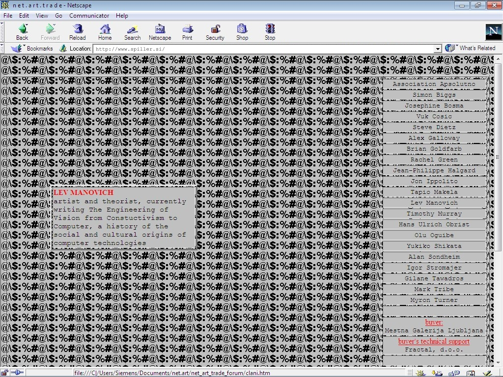
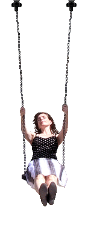
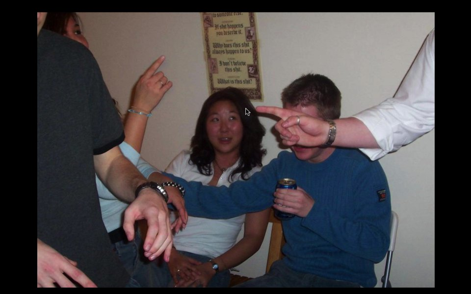
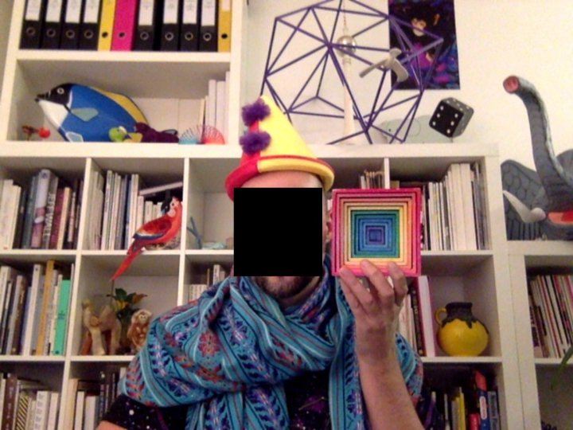

# Net.art / Digital art

<!-- toc -->

En Europe, et plus particulière en Europe de l’est, une scène se développe au milieu des années 90 qui se revendique du mouvement net.art. Les artistes s'approprient le web en l’utilisant de manière modeste dans la forme (sorte d’«Arte Povera» des arts numériques) mais s’impliquant fortement dans l’aspect culturel et politique de ce nouveau réseau.

[http://en.wikipedia.org/wiki/Net.art](http://en.wikipedia.org/wiki/Net.art)

Aujourd’hui on utilise ce terme pour désigner plus largement «L’art en ligne» ou «L’art en réseau».

## Jodi

Jodi ou jodi.org est un collectif d'artistes de deux net-artistes : la néerlandaise Joan Heemskerk (née en 1968) et le belge Dirk Paesmans (né en 1965). Ils vivent et travaillent à Dordrecht aux Pays-Bas et sont des figures emblématiques de l’art en ligne.

Leur travail se porte globalement sur la monstration des problèmes techniques des outils digitaux les plus courants (Stockage, interface, OS,…).

Ils exploitent les failles pour les rendres consultables après que leur créateurs les ait réparées.

http://en.wikipedia.org/wiki/Jodi_%28art_collective%29

http://wwwwwwwww.jodi.org/

http://arts-numeriques.codedrops.net/20location-jodi-1995

## Heat Bunting

Voir un des premiers net artiste. Il utilise en 1994 ces bases: Heat Bunting, CV et projets, my first web page, Phone In (@king X)

Heath Bunting est un artiste contemporain anglais né en 1966. Basé à Bristol, il est le fondateur du site irational.org et l’un des fondateurs au début des années 90 du mouvement Net.art. Activiste, il crée un **faux site du CERN (pose deja la question de l’identité)** ou encore maintient **une carte des radios pirates (internet comme outils subversif) de Londres**. Ses derniers travaux s’éloignent du réseau pour prendre des formes plus urbaines : dérive en skateboard, cartographie ... (expérience des limites)

http://www.irational.org/cta/

Bio/ cv: http://irational.org/cgi-bin/cv2/temp.pl

Irrational.org: http://www.kuda.org/en/wonderful-world-irationalorg-tools-techniques-and-events-1996-2006-novi-sad

## The Yes Men

Juste pour référence comme vous l’avez sans doute déjà aborder dans d’autre cours.

## Olia Lialina: Summer

Un gif animé découpé et séquencé sur plusieurs nom de domaine.
C'est un bel exemple de décentralisation.

http://www.evan-roth.com/olia/summer/

Elle se balance entre différents sites dont elle fait elle même partie.
Si le web avait été décentralisé depuis le début, et qu'un des sites aurait disparu, nous aurions quand même pu accéder au même gif.
Cette œuvre est une tentative cassée de décentralisé le contenu d’une œuvres. Mais elle est défaillante, car comme chaque site redirige vers un autre, il suffit qu’un des sites disparaissent pour casser la chaîne.

## Alexei Shulgin's Form Art

_1997 Alexei Shulgin's Form Art - Artsy.net_

Cette œuvre est un labyrinthe crée avec des formulaire web.
C'est une défonctionalisation claire d’un des composant majeur du web, leurs contenu étant envoyé dans le néant.

https://www.artsy.net/artwork/alexei-shulgin-form-art

## Mendi Lewis Obadike

http://blacknetart.com/keepingupappearances.html

## Dina Kelberman

http://dinakelberman.tumblr.com/

I’m Google is an ongoing tumblr blog in which batches of images and videos that I cull from the internet are compiled into a long stream-of-consciousness. Both the searching and arranging processes are done manually. The batches move seamlessly from one subject to the next based on similarities in form, composition, color, and theme. This results visually in a colorful grid that slowly changes as the viewer scrolls through it. Images of houses being demolished transition into images of buildings on fire, to forest fires, to billowing smoke, to geysers, to bursting fire hydrants, to fire hoses, to spools of thread. The site is constantly updated week after week, batch by batch, sometimes in bursts, sometimes very slowly.

The blog came out of my natural tendency to spend long hours obsessing over Google Image searches, collecting photos I found beautiful and storing them by theme. Often the images that interest me are of industrial or municipal materials or everyday photo snapshots. I do not select images or videos that appear to be intentionally artistic. Happily, the process of researching various themes in this way has lead to unintentionally learning about topics I might never have otherwise, including structural drying, bale feeders, B2P, VAWTs, screw turbines, the cleveland pack, and powder coating.

I feel that my experience wandering through Google Image Search and YouTube hunting for obscure information and encountering unexpected results is a very common one. My blog serves as a visual representation of this phenomenon. This ability to endlessly drift from one topic to the next is the inherently fascinating quality that makes the internet so amazing.

A NOTE ON THE PROCESS

Just wanted to add a note on how I make this blog, as I have seen people wonder the same couple things frequently.

Firstly, lots of people ask if it's a algorithm or something. It's not! Just me searchin google.

Secondly, a lot of people assume this blog is therefore made predominantly by using the "visually similar" function on Google Image Search, which is a totally reasonable thing to assume. While I definitely use that function in my attempts to search thoroughly (and love it for it's own beautiful results), surprisingly little of the piece is actually constructed using it. Visually Similar appears to employ an algorithm based mainly on color percentages in an image, and as I'm Google is based more often in conceptual similarities than color-wash similarities, my searching is almost entirely relient on keywords rather than searching by image. Of course, there are times when Visually Similar has helped with a transition or section here or there, but overall, it's not the way I work.

I hope you enjoyed my first FAQ

– Dina Kelberman

## Donald Hanson

I created an net art piece that moves to a new URL whenever someone views it. It is not possible to link to the art piece. Over time the art piece will become very hard to view. This is an experiment in introducing artificial scarcity into digital work.

https://t.co/L3FZ2lJDKE

## Jamie Zawinski

Hacker culture site - https://www.jwz.org/

## Jonathan Puckey

http://pointerpointer.com/

Ou plus sérieusement:

_[Using internet as design tools](https://puckey.studio/projects/van-abbemuseum)_

Ou encore

_[Anti selfie club](https://puckey.studio/projects/anti-selfie-club)_

## Mario Klingemann

Ai art, neural quasimodo
http://mario-klingemann.tumblr.com/

## Kyle McDonald

Site: http://kylemcdonald.net/

Shu Lea Cheang's I.K.U. in the style of Picasso's "Girl with Mandolin". Excerpt begins at 39:42, the scene with all the inflatable dolls. More on I.K.U.: imdb.com/title/tt0255233/

https://vimeo.com/138217571

## Ben Kinsley:

http://benkinsley.com/street-with-a-view/

## Paolo Cirio:

http://www.paolocirio.net/work/street-ghosts/

Life-sized pictures of people found on Google's Street View were printed and posted without authorization at the same spot where they were taken. The posters are printed in color on thin paper, cut along the outline, and then affixed with wheatpaste on the walls of public buildings at the precise spot on the wall where they appear in Google’s Street View image. Street Ghosts reveals the aesthetic, biopolitical, privacy and legal issues, which can be explored through the artist’s statement and theoretical considerations. The artwork becomes a performance, re-contextualizing not only ready made informational material, but also a conflict. Ghostly human bodies appear as casualties of the info-war in the city, a transitory record of collateral damage from the battle between corporations, governments, civilians and algorithms.

## SOOZ collectif

http://sooz.global/
http://prostheticknowledge.tumblr.com/post/126370521356/sooz-online-net-art-exhibition-features-new-pieces
http://sooz.global/#/feelingclose

## Jan Robert Leegte

http://www.bluemonochrome.com/

## Jon Rafman

http://9-eyes.com/

## Emilio Vavarella

Chasseur de glitch sur google street view
http://emiliovavarella.com/archive/google-trilogy/report-a-problem/

## Halley doherty

http://www.theguardian.com/profile/halley-docherty
