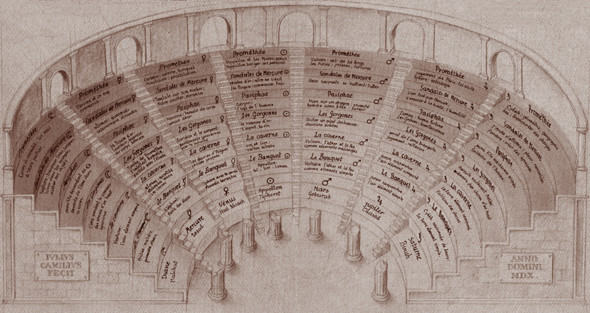

# Art et mémoire

Relation entre la mémoire et internet.
Memoire externe vs internet.
Rapport au livre.

## Le théâtre de la mémoire

> «Pour Saint-Augustin, la mémoire participe à la vie de l’esprit. C’est elle qui instaure de la durée, de la profondeur de champ, qui permet de donner sens aux expériences.
> Ainsi la mémoire est une « chambre intérieure vaste et illimitée » où sont conservées nos actions passées, les images de ce que nous avons vu et perçu mais aussi ce que nous avons appris des arts libéraux ainsi que les affections de l’esprit : joie, tristesse, désir et peur» [^1]

**Est-il possible de mémoriser toute connaissance humaine au moyen d’un nombre fini d’images ?**

Tel était en tout cas le pari audacieux que l’humaniste Giulio Camillo (1480-1544),
considéré comme l’un des personnages les plus célèbres de son temps, tenta de tenir en bâtissant son «théâtre de la mémoire ».

Comme décrit dans «L’art de la mémoire» [^3], la mémoire artificielle se construit en créant à partir de choses dont on veut souvenir, des images mémorables (absurde, sex, symboles).

Ce processus ressemble fort à ce que l’on connait dans la création artistique.

L’artiste étant celui qui crée des images mémorables.

> « Une œuvre n’est pas quelque chose de beau à regarder, sa valeur c’est d'être une école de pensée. L’important est l’image mentale qu’elle imprime. » [^2]

Mais dans ce processus il y a forcément abstraction, ne serait que lors de la symbolization.

On comprend mieux pourquoi la perte liée à l’abstraction est un élément essentiel de la création artistique.

## Memoire externe vs internet.

## La carte n’est pas le territoire

<iframe width="560" height="315" src="https://www.youtube.com/embed/hygJoYP_6pg" frameborder="0" allow="autoplay; encrypted-media" allowfullscreen></iframe>

> «L’expérience n’est pas transmissible, seul le dogmatisme l’est» Aragon.
> « La carte précède le territoire » (Baudrillard).
> Ce dont nous faisons l’expérience (lieux, informations) se réduit à des images qui ont pris la place du réel en l’évacuant.
> Cette disparition du réel ne consiste pas uniquement dans l’annulation de la référence mais se traduit également
> par l’expérience que les sujets en font.

​La carte est une perte dans son abstraction mais aussi dans la perte de l’historique.

Exploration d’une incapacité de transmettre notre expérience du réel.

L’art n’est qu’un language, aussi inefficace qu’un autre pour exprimer une réalité.

Quoique l’on puisse faire, notre incapacité à transmettre une pensée, un message, une image de manière parfaite/complète et sans équivoque est justement ce qui constitue le propre le l’activité artistique.

C'est dans les intersections créées lors du choc des expériences que la chimie s’opère, que le cerveau se reformatte, s’éveille.

## L’internet et le livre

> Le web s’envole et les écris restent

Le web est éphémère mais rare sont les personnes qui s’en rendent compte.
Malgré que cela faisait partie des idées des créateurs du web, le web n’a pas de backup, pas de version, et le les sites changent ou disparaissent.
En fait la réalité est que chacun est responsable de faire son historique du web.
Il y a donc toute une série de savoir qui disparaissent avec le temps et qui sont perdus à jamais.
Heureusement qu’il nous reste les livres et [The Web archives](https://archive.org/web/?&ui3=1)!

[The Web archives](https://archive.org/web/?&ui3=1) nous permet de, par exemple, voir comment le site d’Apple était en 1997 - [https://web.archive.org/web/19970715124703/http://www.apple.com/a](https://web.archive.org/web/19970715124703/http://www.apple.com/a)

Ou de revoir des fameux virus DOS rendus maintenant inoffensif au [Malware museum](https://archive.org/details/malwaremuseum)

Ce côté éphémère à des implications non négligeable en ce sens qu’elle change notre rapport la Vérité et à la responsabilité des paroles.
Quand quelqu’un écrit un livre, il doit bien assumer ce qu’il écrit, à moins de brûler tous les exemplaires du livre.

Pour le web c’est plus compliqué, on peut parfois vite aller effacer et changer du contenus comme si de rien n’était.

On pourrait presque dire que l’internet n’a de mémoire que la somme des traces que ses utilisateurs en ont gardé. La mémoire du web serait-elle une œuvre d’art?

---

[^1]: [La Trinité Intérieure : mémoire, intelligence et volonté chez Augustin](https://fr.wikipedia.org/wiki/Augustin_d%27Hippone)
[^2]: https://fr.wikipedia.org/wiki/Claes_Oldenburg#cite_note-ReferenceA-3
[^3]: L’art de la mémoire, Frances A. Yates, Gallimard 1987
