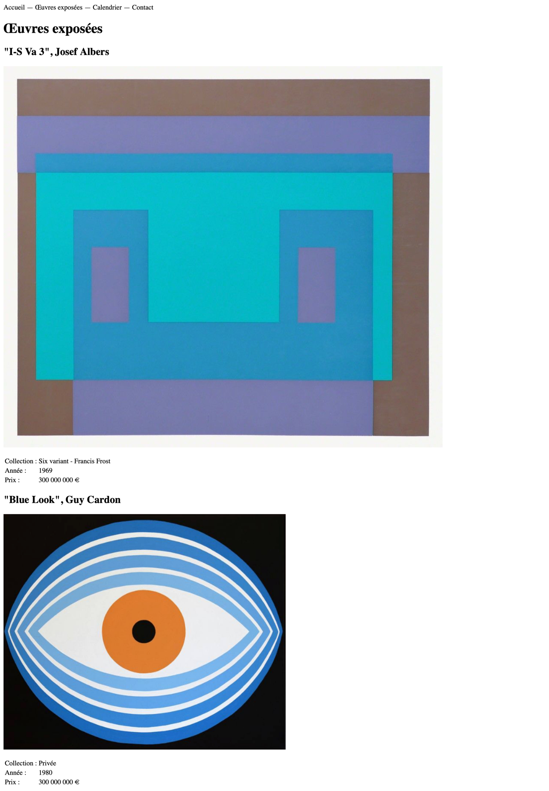
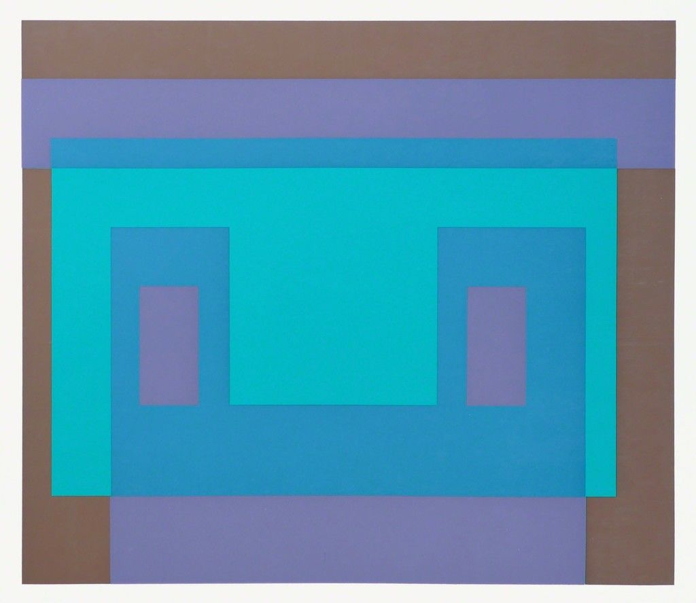
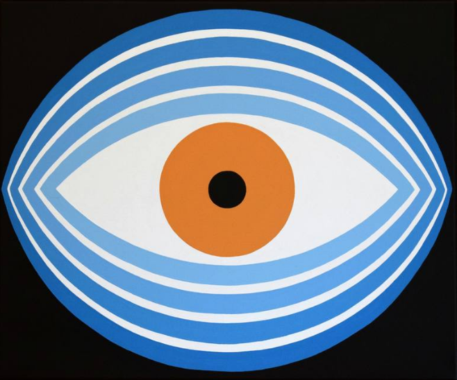

## À faire

- Ajouter une page travaux.html

## Rendu

## Texte

Accueil — Œuvres exposées — Calendrier — Contact
Œuvres exposées
"I-S Va 3", Josef Albers
I-S Va 3

Collection : Six variant - Francis Frost
Année : 1969
Prix : 300 000 000 €
"Blue Look", Guy Cardon
I-S Va 3

Collection : Privée
Année : 1980
Prix : 300 000 000 €

# Images

