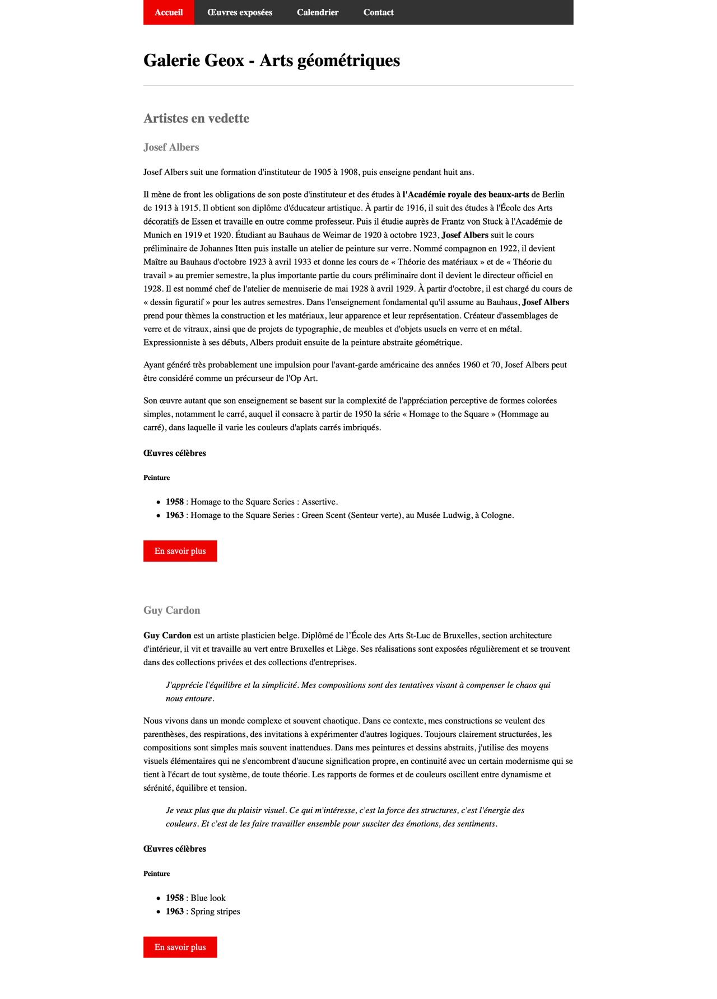

## À faire

- Styliser le menu de navigation (avec style pour current page)
- Ajouter un lien vers css reset dans chaque pages
- Ajouet un lien vers votre css dans chaque pages
- Ajouter des styles (couleurs, marges,…) pour le liens, titres, sections
- centrer le contenu sur la page avec marges interieures

## Rendu

