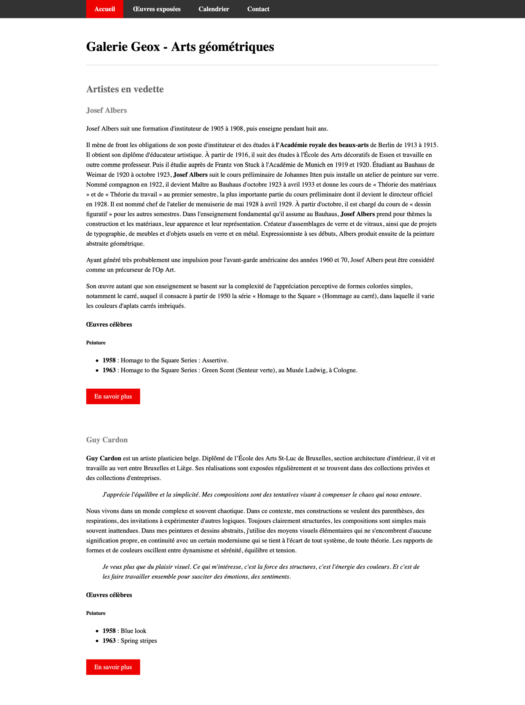

## À faire

- Rendez la navigation fixe
- Remplacer l’image de l’œuvre d’Albers par une version css d’une autre œuvre au choix.

[Resource peinture albers](https://www.google.be/search?q=albers+painting+squares&tbm=isch&tbs=rimg:CW8FL7m2clmHIjjDach_1HqACUwrD5v6yGhsr3evBu9wZEeO3Z9Z-ILYpgekNcd5zsSCtKeCvbmRhdsz33knzbpsAWyoSCcNpyH8eoAJTEWhW22g-4zPDKhIJCsPm_1rIaGysRCnq-gpvgxP0qEgnd68G73BkR4xHaiM54qJYxoSoSCbdn1n4gtimBET0EyVLo9JVFKhIJ6Q1x3nOxIK0R3vzV2irOz5EqEgkp4K9uZGF2zBG8tAePneol-yoSCffeSfNumwBbEfw_1REDeSEMi&tbo=u&sa=X&ved=2ahUKEwjQrfXx0aDhAhUywAIHHYw2CiIQ9C96BAgBEBs&biw=1280&bih=1310&dpr=2)

