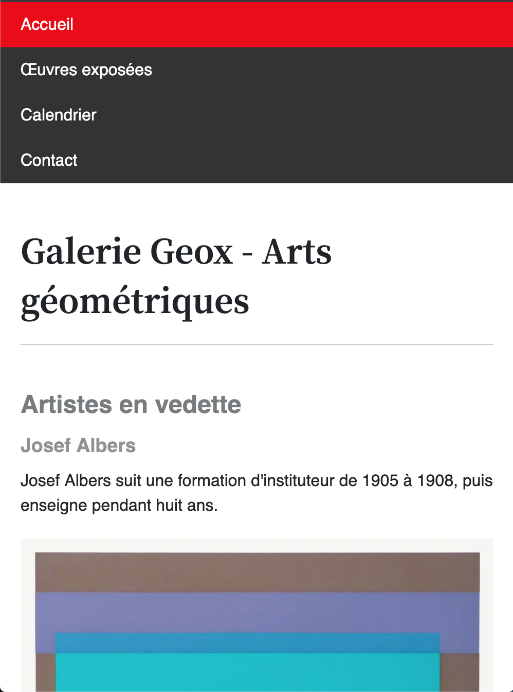
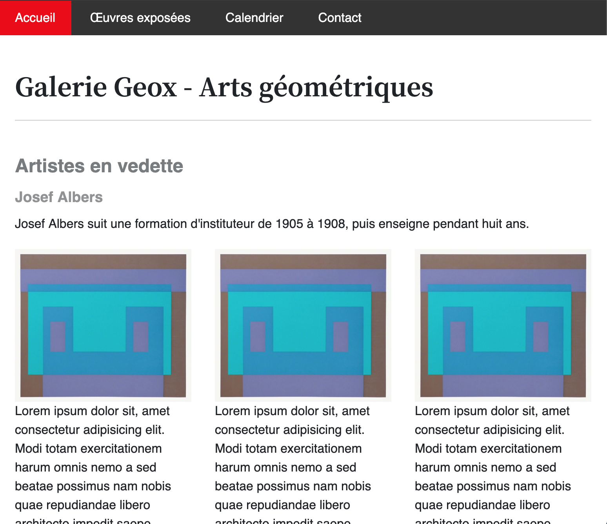
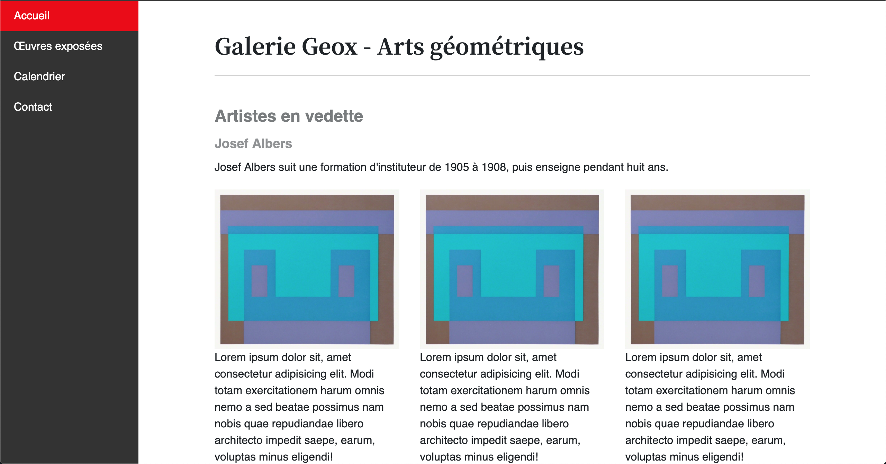

## À faire

- Utiliser les medias query pour ajuster la navigation
- Créer une gallerie d’image dont les colonnes sont les une au dessus des autres sur mobile et l’une à côté des autres à partir du format tablette.

