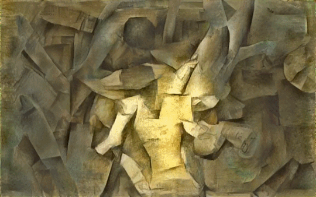

# Net.art / Digital art

<!-- toc -->

# Net.art

Definition du net.art

## Jodi

## Heat Bunting

Voir un des premiers net artiste. Il utilise en 1994 ces bases: Heat Bunting, CV et projets, my first web page, Phone In (@king X)

Heath Bunting est un artiste contemporain anglais né en 1966. Basé à Bristol, il est le fondateur du site irational.org et l’un des fondateurs au début des années 90 du mouvement Net.art. Activiste, il crée un faux site du CERN (pose deja la question de l’identité) ou encore maintient une carte des radios pirates (internet comme outils subversif) de Londres. Ses derniers travaux s’éloignent du réseau pour prendre des formes plus urbaines : dérive en skateboard, cartographie ... (expérience des limites)

http://www.irational.org/cta/

Bio/ cv: http://irational.org/cgi-bin/cv2/temp.pl
Irrational.org: http://www.kuda.org/en/wonderful-world-irationalorg-tools-techniques-and-events-1996-2006-novi-sad

Marcher de L'art sur internet
http://www.artfacts.net/index.php?lang=1&living=1&pageType=ranking&paragraph=4

## Olia Lialina: Summer

Un gif animé découpé et séquencé sur plusieurs nom de domaine.
C'est un bel example de décentralisation.

http://www.evan-roth.com/olia/summer/

## Mendi Lewis Obadike

http://blacknetart.com/keepingupappearances.html

## Dina Kelberman

http://dinakelberman.tumblr.com/

I’m Google is an ongoing tumblr blog in which batches of images and videos that I cull from the internet are compiled into a long stream-of-consciousness. Both the searching and arranging processes are done manually. The batches move seamlessly from one subject to the next based on similarities in form, composition, color, and theme. This results visually in a colorful grid that slowly changes as the viewer scrolls through it. Images of houses being demolished transition into images of buildings on fire, to forest fires, to billowing smoke, to geysers, to bursting fire hydrants, to fire hoses, to spools of thread. The site is constantly updated week after week, batch by batch, sometimes in bursts, sometimes very slowly.

The blog came out of my natural tendency to spend long hours obsessing over Google Image searches, collecting photos I found beautiful and storing them by theme. Often the images that interest me are of industrial or municipal materials or everyday photo snapshots. I do not select images or videos that appear to be intentionally artistic. Happily, the process of researching various themes in this way has lead to unintentionally learning about topics I might never have otherwise, including structural drying, bale feeders, B2P, VAWTs, screw turbines, the cleveland pack, and powder coating.

I feel that my experience wandering through Google Image Search and YouTube hunting for obscure information and encountering unexpected results is a very common one. My blog serves as a visual representation of this phenomenon. This ability to endlessly drift from one topic to the next is the inherently fascinating quality that makes the internet so amazing.

A NOTE ON THE PROCESS

Just wanted to add a note on how I make this blog, as I have seen people wonder the same couple things frequently.

Firstly, lots of people ask if it's a algorithm or something. It's not! Just me searchin google.

Secondly, a lot of people assume this blog is therefore made predominantly by using the "visually similar" function on Google Image Search, which is a totally reasonable thing to assume. While I definitely use that function in my attempts to search thoroughly (and love it for it's own beautiful results), surprisingly little of the piece is actually constructed using it. Visually Similar appears to employ an algorithm based mainly on color percentages in an image, and as I'm Google is based more often in conceptual similarities than color-wash similarities, my searching is almost entirely relient on keywords rather than searching by image. Of course, there are times when Visually Similar has helped with a transition or section here or there, but overall, it's not the way I work.

I hope you enjoyed my first FAQ

– Dina Kelberman

# Digital art

## Mario Klingemann

Ai art, neural quasimodo
http://mario-klingemann.tumblr.com/

## Kyle McDonald

Site: http://kylemcdonald.net/

Shu Lea Cheang's I.K.U. in the style of Picasso's "Girl with Mandolin". Excerpt begins at 39:42, the scene with all the inflatable dolls. More on I.K.U.: imdb.com/title/tt0255233/

https://vimeo.com/138217571

